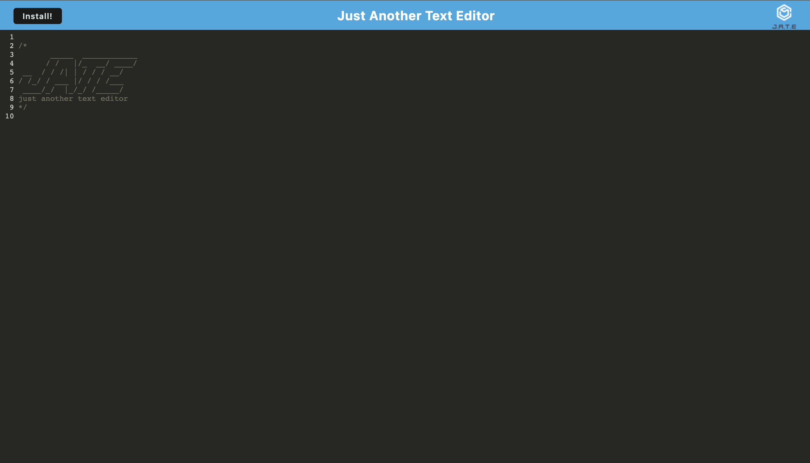

# J.A.T.E. Text Editor v1

The J.A.T.E. Text Editor is a minimalist-style text editor progressive web app (PWA) that can be downloaded and used on the desktop, even when offline. Designed to be like a notepad to drop small snippets of code or text, The J.A.T.E. Text Editor will be there to hold it all for when you do need it.

## Installation

The J.A.T.E. Text Editor is hosted on Heroku at [this link](https://bksb-text-editor-v1.herokuapp.com/). Simply go to the page and type. If you would like to use this application on your desktop directly, click the install button to access the J.A.T.E. Text Editor remotely on your personal device. As a fully-functioning PWA, it should be readily available for use online or offline.

## Usage

Usage of the J.A.T.E. Text Editor is very simple. Upon initiating the web app, you should see a screen like this:

All you need to do is type in the designated area and all of the text that you type will be available to review and for editing. 

One feature to note is that the text will be saved in the database and will be saved in between each session. The whole of the text body will be loaded, so be sure to remove anything that you do not want saved. 

## Contributions

The GitHub repo containing the code can be found [here](https://github.com/jhahnsheen/Text-Editor-v1). Please feel free to take a look at the code. 

This code is only to be used for development and educational purposes. 